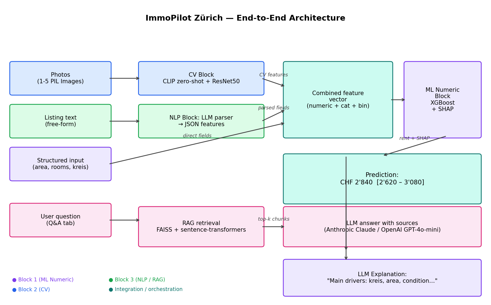

# 🏠 ImmoPilot Zürich

> **Multimodal apartment-rent assistant for the city of Zurich.**
> Predicts a fair market price from listing text, photos, and structured input,
> explains *why* with SHAP, and answers neighborhood questions via RAG.

[](https://huggingface.co/spaces/jegatker/immopilot-zurich)
[](https://github.com/kerisan-jeg/immopilot-zurich/actions)
[](https://www.python.org/downloads/release/python-3120/)
[](LICENSE)
[](https://github.com/psf/black)

---

## ✨ What it does

| Block | Capability | Models / Methods |
|---|---|---|
| 📊 **ML Numeric** | Predicts rent in CHF with confidence interval | Linear · Random Forest · XGBoost · MLP · SHAP |
| 📸 **Computer Vision** | Detects condition, balcony, view, kitchen quality from photos | CLIP zero-shot · fine-tuned ResNet50 |
| 💬 **NLP / RAG** | Parses free-text listings · explains predictions · answers Q&A about neighborhoods | LLM parsing · FAISS · sentence-transformers · multi-provider (Anthropic / OpenAI) |

Outputs of CV become **input features** for the numeric model. The numeric prediction
and its SHAP contributions become **input** for the LLM-generated explanation, and a
listing-text parser feeds structured fields back into the numeric model. The blocks are
not parallel — they form one coherent pipeline.

---

## 🏛️ Architecture



```
[Photos]  ─── CLIP + ResNet50 ──▶ {condition, balcony, view, kitchen}
                                              │
[Listing text] ── LLM parser ───▶ {area, rooms, kreis}
                                              │
                                              ▼
[Combined features] ── XGBoost ──▶ CHF estimate + 80% interval
                                              │
                                              ▼
[Prediction + SHAP] ── LLM ──▶ German explanation of the main drivers
```

---

## 🚀 Quickstart

```bash
git clone https://github.com/kerisan-jeg/immopilot-zurich.git
cd immopilot-zurich

# 1. Environment
python3.12 -m venv .venv
source .venv/bin/activate          # Windows: .venv\Scripts\activate
pip install -r requirements.txt

# 2. Secrets
cp .env.example .env
# → edit .env, add ANTHROPIC_API_KEY (or OPENAI_API_KEY)

# 3. Reproduce everything (data → features → train → index)
make reproduce

# Or step by step
make data        # download / prepare raw data
make features    # build feature tables
make train       # train all numeric + CV models
make index       # build RAG vector store
make app         # launch Gradio app on http://localhost:7860
```

> Note: the raw Kaggle listings CSV and the apartment images are not committed
> (see `data/raw/SNAPSHOT.md` for provenance). The processed `features.parquet`,
> the district table, and all `models/*.metrics.json` **are** committed, so the
> headline numbers can be verified without re-downloading anything via
> `python scripts/freeze_test_predictions.py`.

---

## 📁 Project Structure

```
immopilot-zurich/
├── README.md                  ← you are here
├── docs/
│   ├── DOCUMENTATION.md       ← full project documentation (graded)
│   ├── architecture.png
│   ├── repro/                 ← frozen test predictions + metrics
│   ├── cv_eval/ ablation/ rag_eval/   ← evaluation artifacts
│   └── screenshots/
├── src/immopilot/             ← all reusable code
│   ├── data/                  ← loaders, joiners
│   ├── features/              ← preprocessing pipelines
│   ├── models/                ← train_*.py + _common.py
│   ├── cv/                    ← CLIP + ResNet50
│   ├── nlp/                   ← RAG, parser, explainer
│   └── inference/             ← end-to-end pipeline
├── app/app.py                 ← Gradio UI (HF Space entry point)
├── notebooks/                 ← EDA
├── tests/                     ← pytest smoke tests
├── scripts/                   ← eval + reproduction scripts
├── data/                      ← .gitignored except small processed tables
└── models/                    ← xgboost.joblib + preprocessor.joblib + metrics JSONs committed; large models (RF, ResNet) gitignored (retrain via `make train`)
```

---

## 📊 Results

| Model | MAE (CHF) | RMSE | R² | Notes |
|---|---:|---:|---:|---|
| Linear (Ridge) | 427.6 | — | 0.720 | baseline |
| Random Forest | 364.4 | — | 0.748 | |
| XGBoost | **308.6** | 603.1 | **0.797** | champion (Optuna-tuned, leakage-free) |
| MLP (PyTorch) | 4148 | — | −243 | diverged (not a fair baseline) |

Test split: 67 rows (10%, seed 42), of which 3 are in the city of Zurich — see the
caveat in `docs/DOCUMENTATION.md` §2A.5. Verify from committed artifacts with
`python scripts/freeze_test_predictions.py`.

**CV — condition classifier** (18-image validation set)

| Model | Accuracy | Macro-F1 |
|---|---:|---:|
| CLIP zero-shot | 0.72 | 0.66 |
| ResNet50 fine-tuned | 0.83* | 0.84* |

*Final-epoch macro-F1 shown; the best-epoch checkpoint reached 1.00 on the 18-image validation set but that is an in-distribution artifact (small, stock-photo-style
val set — see §2C.5). The deployed app uses zero-shot CLIP, which degrades more
gracefully on real uploads.

**RAG** — retrieval Hit-Rate@5 **0.85**, MRR **0.504**, citation rate **100%** on a
20-question gold set: see `docs/DOCUMENTATION.md` §2B.5.

---

## 📚 Documentation

Full project documentation following the assignment template:
**[docs/DOCUMENTATION.md](docs/DOCUMENTATION.md)**

- §1 Project Foundation (problem, integration logic)
- §2 Block Documentation (2A ML Numeric · 2B NLP · 2C Computer Vision)
- §3 Deployment · §4 Execution Instructions · §5 Optional Bonus Evidence

---

## 🧪 Reproducibility

- All random seeds pinned (`SEED = 42`, see `src/immopilot/config.py`)
- `requirements.txt` uses `==` pinning
- Data provenance logged in `data/raw/SNAPSHOT.md`
- Committed artifacts (`features.parquet`, `models/*.metrics.json`, `docs/repro/`)
  let a grader verify the headline numbers without the raw download
- CI runs blocking lint (ruff) + the pytest suite on every push

---

## 👥 Course Context

Final project for **AI Applications**, ZHAW SML, Spring 2026.
Lecturers: Jasmin Heierli ([@jasminh](https://github.com/jasminh)) · Benjamin Kühnis ([@bkuehnis](https://github.com/bkuehnis)) — both added as collaborators.

## 📜 License

MIT — see [LICENSE](LICENSE).
