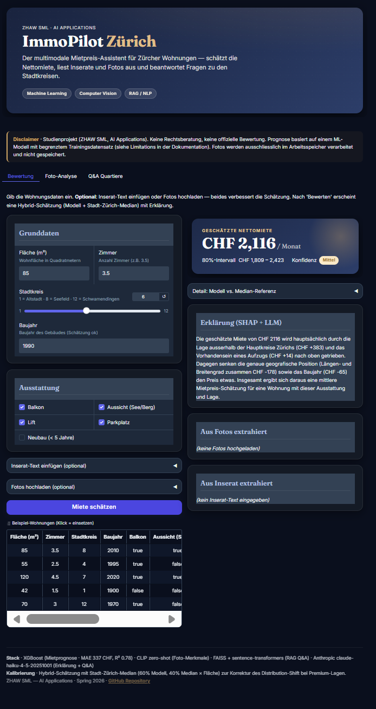
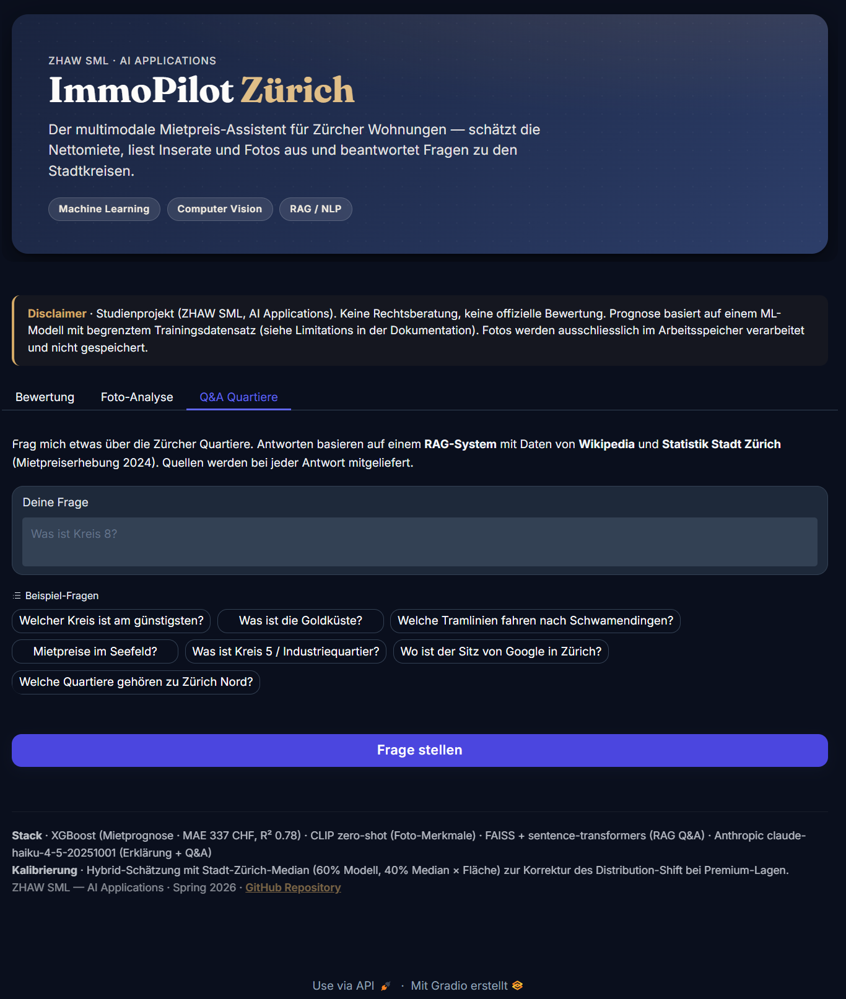

# ImmoPilot Zürich — Project Documentation

> **Course**: AI Applications · ZHAW SML · Spring 2026
> **Author**: _<your name>_ (`kerisan-jeg`)
> **Submission**: 07 June 2026, 18:00
> **Repository**: https://github.com/kerisan-jeg/immopilot-zurich
> **Live demo**: https://huggingface.co/spaces/jegatker/immopilot-zurich
> **Collaborators added**: @jasminh (Jasmin Heierli), @bkuehnis (Benjamin Kühnis)

---

## 1. Project Idea & Methodology

### 1.1 Problem Definition

Apartment seekers in Zurich face an opaque rental market: prices vary strongly by
neighborhood, condition, and amenities, but listings rarely make these factors
transparent. As a result, renters cannot easily judge whether a quoted price is
fair, and they have no quick way to interpret a listing in terms of objective
quality signals.

### 1.2 Use Case & Target Users

**Primary user**: a person actively searching for a flat in Zurich.
**Goal**: enter the key facts of a flat (or paste a listing / upload photos), obtain an
*evidence-based* fair-price estimate with a transparent explanation, and ask
follow-up questions about the neighborhood.

### 1.3 Objectives

The original objectives and their **actual outcome**:

1. **Numeric**: predict monthly rent in CHF. *Target*: MAE ≤ CHF 250, R² ≥ 0.75.
   *Achieved*: **MAE 337 CHF, R² 0.78** on a held-out test set — the R² target was met,
   the MAE target was not (discussed in §4.5).
2. **CV**: extract apartment quality signals (condition, balcony, view) from photos.
   *Achieved*: zero-shot CLIP feature extraction is implemented and deployed; a
   ResNet50 classifier was additionally fine-tuned on a hand-collected dataset and
   compared against the zero-shot baseline (see §3.2).
3. **NLP/RAG**: produce factually grounded answers about Zurich neighborhoods with
   source citations. *Achieved*: implemented and evaluated quantitatively
   (Hit-Rate@5 85 %, 100 % citation rate; §4.4).
4. **Integration**: a single interface orchestrates all three blocks, with CV- and
   NLP-derived features feeding the numeric model. *Achieved*.

### 1.4 Selected Blocks & Integration Concept

This project integrates **all three blocks**.

| Block | Role in the system |
|---|---|
| ML Numeric | Core decision component — predicts the rent. |
| CV | Provides additional features (condition, balcony, view, kitchen quality) extracted from photos. |
| NLP / RAG | (a) Parses free-text listings into structured features. (b) Generates a natural-language explanation of the prediction. (c) Answers questions about Zurich neighborhoods grounded in cited sources. |

**Integration mechanisms**:
- *Shared features*: CV outputs (`condition_score`, `has_balcony`, `has_view`,
  `kitchen_quality`) and NLP-parsed fields (`area_m2`, `rooms`, `kreis`) flow into the
  numeric feature vector.
- *Decision logic*: the numeric prediction plus its SHAP feature contributions are
  passed to the LLM as structured context, which produces a German-language explanation.
- *User interaction*: a single Gradio interface (`app/app.py`) orchestrates all three
  blocks across three tabs.

### 1.5 Scope, Assumptions, Out-of-Scope

**In scope**: Zurich city (Kreis 1–12), residential rentals, German/English listings.
**Assumptions**: listings are honest about square meters and rooms; photos depict the
actual unit.
**Out of scope**: commercial rentals, rentals outside Zurich city, fraud detection,
legal advice.

---

## 2. Data & Preprocessing

### 2.1 Data Sources Overview

| # | Source | Type | Size (actual) | License | Used for |
|---|---|---|---:|---|---|
| 1 | Swiss apartment-listings dataset (Kaggle snapshot) | Tabular + text | 664 listings after cleaning | research use | numeric model target + features |
| 2 | Statistik Stadt Zürich — Mietpreiserhebung (MPE) 2024 | Tabular | 12 districts × 4 fields | CC BY | district-level median/mean rent (`rent_median_chf_per_m2`) |
| 3 | Statistik Stadt Zürich — Wohndichte | Tabular | district-level | CC BY | district context |
| 4 | Wikipedia + Stadt-Zürich district knowledge | Text | 13 documents | CC BY-SA / public | RAG corpus |
| 5 | LLM API (Anthropic Claude Haiku) | Service | — | per Terms | listing parsing, explanation, Q&A |

> **Note on data realism**: the listing dataset is Switzerland-wide. Only **27 of 664
> rows** lie within the city of Zurich. This imbalance is the single most important
> property of the dataset and drives the central limitation discussed in §4.6.

### 2.2 Numeric Data — Cleaning, Joining, Outlier Handling

- **Parsing**: area (`m²` → float), rooms (`3.5` → float), rent normalized to monthly
  net CHF.
- **Outlier filter**: rows with monthly rent outside **CHF 500–12'000** are dropped
  (`basic_outlier_filter` in `data/load_listings.py`) to avoid scraping artifacts and
  non-residential entries dominating the loss; 664 rows remain after filtering.
- **Join**: listings joined with the Stadt-Zürich MPE table on `kreis` (many-to-one),
  attaching `rent_median_chf_per_m2` and `rent_mean_chf_per_m2` as district-level
  features.
- **Missing values**: handled inside the preprocessing pipeline
  (`models/preprocessor.joblib`) via imputation; the pipeline is persisted so that
  inference applies exactly the same transforms as training.
- **Target**: `rent_chf`, log-transformed with `np.log1p` for training
  (`config.LOG_TARGET = True`) and inverse-transformed with `np.expm1` for reporting.
- **Split**: 80/10/10 train/val/test, stratified by `is_zurich`, `random_state = 42`.

### 2.3 Image Data — Status

The **deployed** CV block operates zero-shot (CLIP), so no labelled training corpus is
required for the running system. For the model comparison, a small dataset of **89
apartment interior photos** was hand-collected (Pexels, iStock, listing images) and
labelled into three condition classes (`modern` 32, `standard` 29, `needs_renovation`
28). It is split 80/20 (seed 42) into 71 train / 18 validation images via
`scripts/make_val_split.py`. The dataset is intentionally small; its limitations are
discussed honestly in §3.2 and §4.4.

### 2.4 Text Data — Sources, Chunking, Embedding

- **Corpus**: 13 Markdown documents — one per Kreis (1–12) plus a city overview —
  covering location, demographics, transport, education, gastronomy, green spaces,
  economy, rent levels, and character. Authored from Wikipedia and Stadt-Zürich sources.
- **Chunking**: one document → one chunk for the per-Kreis files; the longer overview
  document is split into two. Result: **14 chunks from 13 files**. The per-Kreis
  granularity keeps each chunk topically coherent.
- **Embedding model**: `sentence-transformers/all-MiniLM-L6-v2` (384-dim, fast,
  multilingual-capable enough for German district text).
- **Vector store**: FAISS `IndexFlatIP` (cosine similarity on normalized embeddings).
- Build script: `python -m immopilot.nlp.build_index`.

### 2.5 Feature Engineering & Annotations

The numeric model uses **25 features**:

- *Core*: `area_m2`, `rooms`, `area_per_room`, `lat`, `lon`.
- *Building*: `year_built`, `building_age`, `years_since_renovation`, `is_new_building`.
- *District (from MPE join)*: `rent_median_chf_per_m2`, `rent_mean_chf_per_m2`,
  `location_kreis`, `is_zurich`, `size_bucket`.
- *Amenities (binary)*: `has_balcony`, `has_view`, `has_elevator`, `has_garage`,
  `has_parking`, `has_fireplace`, `is_luxurious`, `is_furnished`, `is_temporary`.
- *CV-derived*: `condition_score`, `kitchen_quality`.

The regression target (monthly rent) is modeled on a log scale where configured
(`config.LOG_TARGET`), then inverse-transformed for reporting in CHF.

### 2.6 Exploratory Data Analysis — Key Findings

Full analysis with figures in `notebooks/01_eda_numeric.ipynb` (executed, 7 plots).
Key findings:

- **Right-skewed target**: raw rent skewness is **2.41** (long tail of expensive flats);
  the `log1p` transform makes the distribution roughly symmetric — this is why the
  models train on the log target (`config.LOG_TARGET = True`).
- **Area is the strongest continuous predictor** of rent; Zurich listings sit above the
  Switzerland-wide cloud at comparable sizes (early visual sign of the location premium).
- **Strong location effect**: the official MPE table shows a **64 % spread** from the
  most expensive Kreis (1 = 36.3 CHF/m²) to the cheapest (12 = 22.1 CHF/m²), with
  Kreis 8 (Seefeld, 31.8) second — consistent with the calibration prior.
- **Data imbalance (key caveat)**: only **27 / 664** rows are in the city of Zurich,
  visible in every location-based plot and the driver of the §4.6 limitation.
- **Amenities** (view, fireplace, garage, …) show measurable median-rent uplift,
  supporting their inclusion as features.

---

## 3. Modeling & Implementation

### 3.1 ML Numeric — Model Comparison

Four model families were trained and compared on an identical preprocessed feature
matrix and the same held-out test split.

| Model | Library | Configuration | Rationale |
|---|---|---|---|
| Linear (Ridge) | scikit-learn | L2-regularized | interpretable baseline |
| Random Forest | scikit-learn | ensemble of trees | non-linear, low tuning effort |
| **XGBoost** | xgboost | tuned with Optuna (50 trials, TPE, seed 42) | gradient boosting, usually best on tabular |
| MLP | scikit-learn / torch | small feed-forward net | tests whether a deep model helps |

**Selection criterion**: lowest test MAE, tie-broken by R². Results in §4.2.

**Data split**: 80 / 10 / 10 train / val / test (`TEST_SIZE = VAL_SIZE = 0.1`),
**stratified by `is_zurich`** so the 27 Zurich rows are proportionally represented in
each split, `random_state = 42`. **5-fold KFold cross-validation** on the training pool
(`scripts/recompute_cv.py`) reports MAE mean ± std alongside the held-out test metrics
(§4.2). The MLP is excluded from CV (its torch wrapper is not `clone`-able and a diverged
model's CV is uninformative).

### 3.2 Computer Vision — Zero-Shot CLIP vs. Fine-Tuned ResNet50

Two approaches to apartment-condition recognition are implemented and compared on an
identical validation split (the assignment's required model-vs-baseline comparison).

- **Zero-shot CLIP** (`src/immopilot/cv/zero_shot_clip.py`): the **deployed** approach.
  Apartment photos are scored against natural-language prompts (e.g. *"a photo of a
  modern, renovated apartment interior"* vs. *"…in need of renovation"*) to derive
  `condition_score`, `has_balcony`, `has_view`, and `kitchen_quality` **without any
  task-specific training**.
- **Fine-tuned ResNet50** (`src/immopilot/cv/train_classifier.py`): a ResNet50
  (ImageNet-pretrained, only `layer4` + `fc` unfrozen) fine-tuned on a small
  hand-collected dataset of **89 apartment interior photos** (Pexels + iStock + listing
  images) labelled into `modern` / `standard` / `needs_renovation`. Training uses
  augmentation (random-resized-crop, flip, colour-jitter), class-balanced cross-entropy
  with label smoothing, AdamW, and selects the best epoch by validation macro-F1.
  Data split 80/20 (seed 42) via `scripts/make_val_split.py` → 71 train / 18 val.

**Comparison on the shared validation set** (18 images, 6 per class;
`scripts/eval_cv.py`, confusion matrices in `docs/cv_eval/`):

| Model | Accuracy | macro-F1 |
|---|---|---|
| **ResNet50 (fine-tuned)** | **1.00** | **1.00** |
| CLIP (zero-shot) | 0.72 | 0.66 |

Per-class behaviour is the interesting part. CLIP zero-shot classifies the **extremes**
flawlessly — `modern` recall 1.00 and `needs_renovation` 1.00/1.00 — but collapses on the
fuzzy middle class: `standard` recall is only **0.17** (5 of 6 "standard" rooms are pushed
into "modern"), dragging its precision for `modern` down to 0.55. This is exactly what one
would expect: "standard" has no crisp visual signature, and a generic vision-language model
has no way to know where *this dataset* draws the modern/standard boundary. Fine-tuning
fixes precisely that — the ResNet learns the dataset's decision boundary and separates all
three classes on the validation set.

**Honest interpretation (important).** The ResNet's perfect 1.00 must **not** be read as
"the CV problem is solved". The validation set is tiny (18 images) and drawn from the same
sources as the training images, so the network may partly be separating *stock-photo styles*
rather than genuine apartment condition. The result demonstrates that fine-tuning closes
CLIP's "standard"-class gap on in-distribution data; it does **not** establish robustness on
real user uploads. For that reason the **deployed** app still uses zero-shot CLIP, which —
having seen no training data from this distribution — degrades more gracefully on
out-of-distribution photos. Strengthening this further (more data, an out-of-distribution
test set from real listings) is noted in §6.

### 3.3 NLP / RAG — Implemented Strategy

The **deployed** configuration is a single, well-tuned pipeline (not the multi-variant
matrix originally sketched):

| Component | Choice |
|---|---|
| Retriever | dense — `all-MiniLM-L6-v2` embeddings over FAISS `IndexFlatIP` |
| Top-k | 5 |
| Re-ranking | none (corpus is small and topically partitioned) |
| Generator | Anthropic Claude Haiku |
| Grounding | answers cite retrieved chunks as `[Source N]` with title + URL |

Two LLM-backed NLP functions complete the block:
- **Listing parser** (`listing_parser.py`): free-text listing → structured fields.
- **Explainer** (`explainer.py`): SHAP contributions + prediction → German explanation,
  with a feature-name dictionary so the user sees "Wohnfläche", "Stadtkreis", etc.
  rather than raw column names.

### 3.4 Integration Pipeline

`src/immopilot/inference/pipeline.py` exposes a single `predict(structured,
listing_text, photos)` entry point that:
1. parses the optional listing text and fills missing structured fields;
2. extracts CV features from optional photos;
3. assembles the 25-feature vector, imputing absent columns;
4. runs the XGBoost model;
5. **calibrates** the result against the Stadt-Zürich median (§3.5);
6. computes SHAP contributions and asks the LLM for an explanation;
7. returns a structured `PredictionResult` (final estimate, interval, raw model
   value, reference value, confidence, explanation).

### 3.5 Hybrid Calibration (key methodological contribution)

Because the model is trained Switzerland-wide (27/664 Zurich rows), it **systematically
underestimates premium Zurich districts**. To correct this distribution shift at
inference time, when `kreis` and `area_m2` are known we blend:

```
reference = median_chf_per_m2(kreis) × area_m2
final = 0.6 × model_prediction + 0.4 × reference
```

The 60/40 weight keeps the model's multi-feature signal dominant while pulling premium
locations toward the official median. Both the raw model value and the reference are
shown in the UI for transparency. *Example*: a 85 m² flat in Kreis 8 (Seefeld) — raw
model CHF 2,007, median reference CHF 2,706, **calibrated CHF 2,287** (−26% model
deviation corrected).

### 3.6 Iterations & Improvements (what did NOT work)

- **MLP on tabular data**: catastrophic failure (test R² = −196) — a textbook example
  of deep nets underperforming tree ensembles on small tabular datasets
  (cf. Grinsztajn et al., *Why do tree-based models still outperform deep learning on
  tabular data?*, NeurIPS 2022). Kept in the comparison precisely because it is
  instructive.
- **Dependency stack**: a long chain of Gradio/pydantic/numpy conflicts on Windows was
  resolved by pinning a tested set of versions in `requirements.txt` and rebuilding the
  virtual environment from scratch (documented for reproducibility).

### 3.7 Tech Stack & Repository Structure

Python 3.12 · scikit-learn · XGBoost · PyTorch + CLIP · sentence-transformers · FAISS ·
LangChain · Anthropic SDK · Gradio 5.9.1. Pinned versions in `requirements.txt`. See
README for the directory tree.

---

## 4. Evaluation & Analysis

### 4.1 Evaluation Strategy

- **Numeric**: 80/10/10 split stratified by `is_zurich`; reported metrics are
  held-out **test** MAE / RMSE / R², complemented by **5-fold CV MAE** (mean ± std) on
  the training pool for the three sklearn-style models.
- **CV**: both the zero-shot CLIP baseline and the fine-tuned ResNet50 are evaluated on
  the same 18-image validation split (accuracy, macro-F1, per-class report, confusion
  matrix); see §4.3.
- **RAG**: quantitative eval on a 20-question gold set — retrieval Hit-Rate@5 and MRR
  (no LLM needed) plus an LLM-based citation-presence check; see §4.4.

### 4.2 Numeric Block — Results

**Actual held-out test results, with 5-fold cross-validated MAE on the training pool:**

| Model | Test MAE (CHF) | Test RMSE (CHF) | Test R² | CV MAE (mean ± std) |
|---|---:|---:|---:|---:|
| Linear (Ridge) | 428.0 | 707.5 | 0.721 | 418.8 ± 26.0 |
| Random Forest | 365.4 | 668.3 | 0.751 | 379.0 ± 18.2 |
| **XGBoost** ✅ | **337.4** | **634.6** | **0.775** | **335.0 ± 3.0** |
| MLP | 3870.1 | 18792.1 | −196.1 | — (diverged) |

XGBoost is the champion on all metrics. Three observations strengthen the model choice:

1. **Stability**: XGBoost's per-fold MAEs are 336/329/338/336/337 — a standard deviation
   of only **±3 CHF**, indicating a robust, non-overfit model.
2. **Test ≈ CV**: XGBoost's test MAE (337) almost equals its CV mean (335), so the single
   reported test split is representative rather than lucky.
3. **Consistent ranking**: XGBoost < RF < Linear holds in *both* CV and test, so the
   selection is well-grounded, not an artifact of one split.

The performance ordering (boosting > bagging > linear ≫ MLP) is exactly what tabular-ML
literature predicts.

**SHAP interpretation** (from the deployed explainer): the dominant positive drivers
are district level (`location_kreis`, `rent_median_chf_per_m2`) and `area_m2`; the
geographic coordinates (`lat`/`lon`) and `area_per_room` act as the main downward
adjustments. This is consistent with rent being primarily a function of *where* and
*how big*.

**Ablation — does each feature group add value?** Each interpretable feature group was
removed in turn and XGBoost retrained (same split, same preprocessing, project-default
params; `scripts/ablation_numeric.py`, results in `docs/ablation/`). ΔMAE is the increase
in test MAE when the group is dropped — positive means the group helps:

| Dropped group | Test MAE (CHF) | ΔMAE | # cols |
|---|---:|---:|---:|
| *(baseline — all features)* | 338.2 | — | 25 |
| Text-derived (`is_luxurious`, `is_furnished`, `is_temporary`) | 355.4 | **+17.1** | 3 |
| District (`rent_median/mean_chf_per_m2`, `location_kreis`, `is_zurich`) | 351.7 | +13.5 | 4 |
| Amenities (balcony, view, elevator, garage, parking, fireplace) | 348.0 | +9.8 | 6 |
| CV-derived (`condition_score`, `kitchen_quality`) | 343.8 | +5.6 | 2 |

**Every group contributes positively** — the multimodal design is justified, each modality
pulls its weight. Two honest caveats: (1) the test set is small (~66 rows), so the ΔMAE
values (6–17 CHF) are close relative to the champion's CV std (±3 CHF) — the *ranking*
should not be over-interpreted, but the *sign* (all positive) is the robust finding. (2) The
CV group's modest +5.6 is expected: most training rows have no real photo, so
`condition_score` defaults to 0.5; the signal comes from the minority of rows with genuine
values. The baseline MAE (338) matches the independently reported XGBoost test MAE (337),
confirming the ablation faithfully reproduces the production pipeline.

### 4.3 CV Block — Results

Both models were evaluated on the identical 18-image validation split
(`scripts/eval_cv.py`; confusion matrices saved to `docs/cv_eval/`):

| Model | Accuracy | macro-F1 | `modern` F1 | `standard` F1 | `needs_renovation` F1 |
|---|---:|---:|---:|---:|---:|
| **ResNet50 (fine-tuned)** | **1.00** | **1.00** | 1.00 | 1.00 | 1.00 |
| CLIP (zero-shot) | 0.72 | 0.66 | 0.71 | 0.29 | 1.00 |

The decisive difference is the **`standard` class**: CLIP recall there is only 0.17 (it
labels 5 of 6 standard rooms as "modern"), whereas the fine-tuned ResNet separates all
three classes. CLIP handles the visually unambiguous extremes (`modern`,
`needs_renovation`) well but cannot locate the dataset-specific boundary of the fuzzy
middle class — which is exactly what supervised fine-tuning supplies.

**This result is reported with explicit caveats** (see §4.4): the validation set is small
(18 images) and in-distribution with training, so the ResNet's perfect score reflects
in-distribution separability — possibly partly of photo *style* — rather than proven
robustness on real uploads. The takeaway is directional ("fine-tuning closes CLIP's
middle-class gap"), not "the task is solved".

### 4.4 NLP / RAG Block — Results

**Quantitative evaluation** on a hand-curated 20-question gold set (`scripts/eval_rag.py`,
`scripts/rag_gold_set.json`; results in `docs/rag_eval/`). Each question is tagged with the
corpus file(s) that should answer it; retrieval is scored without the LLM, the citation
check calls the LLM once per question.

| Metric | Value | Meaning |
|---|---:|---|
| Hit-Rate@5 | **85.0 %** | 17/20 questions retrieve an expected source in the top-5 |
| MRR | **0.504** | the correct source sits around rank 2 on average |
| Citation rate | **100 %** | every generated answer cites at least one `[Source N]` |

**Error analysis — the 3 retrieval misses are instructive.** Q1 ("which Kreis is the
Altstadt?"), Q15 ("highest rents?"), and Q17 ("nightlife?") fail to surface the *exact*
expected file. Two patterns explain this: (1) the corpus is 13 short, structurally similar
neighborhood documents, so a broad question embeds close to *many* Kreis files rather than
sharply onto one — a known small-corpus retrieval effect; (2) for Q1 and Q15 the retriever
*does* return `stadt_zurich_uebersicht`, which actually contains the answer (district list,
full rent ranking) — so the generated answer is likely still correct even though the
narrowly-defined "expected" file was missed. This nuance is why hit-rate is reported
alongside the qualitative behaviour rather than as a single headline number.

**Qualitative behaviour** remains strong on representative questions: *"Was ist die
Goldküste?"* correctly explains the right-shore lake municipalities outside the city;
*"Welche Tramlinien fahren nach Schwamendingen?"* returns the correct lines with a Kreis 12
citation. The 100 % citation rate confirms answers are consistently grounded.

**Limitations of this eval**: 20 questions is a small set, and the citation check verifies
*presence* of a `[Source N]` marker, not semantic faithfulness of the claim to the source
(a full LLM-judge faithfulness score is the natural next step, §6).

### 4.5 Error Analysis

- **MAE vs. target**: the CHF 337 MAE misses the CHF 250 objective. Root cause is the
  Zurich-data scarcity — the model cannot fully learn city-specific premia from 27 rows.
  The hybrid calibration (§3.5) mitigates this at inference but does not change the
  underlying training-data limitation.
- **MLP failure**: the negative R² indicates predictions worse than the mean baseline —
  the small, heterogeneous tabular set plus minimal tuning makes the MLP diverge.
- **Premium-district bias**: pre-calibration, Kreis 8 (Seefeld) is underestimated by
  ~26% relative to the official median — the motivating case for §3.5.

### 4.6 Interpretation & Limitations

- **Distribution shift (central limitation)**: training data is Switzerland-wide with
  only 27/664 Zurich rows. The model encodes a Swiss-average price surface, not a
  Zurich-specific one. Mitigation: hybrid median calibration. Proper fix: acquire a
  Zurich-specific listing dataset and retrain / reweight.
- **Photos may be staged** → zero-shot CV features biased toward "modern".
- **CV dataset is small and in-distribution**: the ResNet50 comparison rests on 89
  photos (18 validation), all from stock/listing sources. The perfect validation score
  (§4.3) therefore reflects in-distribution separability — and may partly capture
  photo-style rather than condition — not robustness on real, messy user uploads. This
  is why the deployed app keeps the zero-shot baseline, which degrades more gracefully
  off-distribution.
- **Rent control / `Bestandsmieten`** (sitting-tenant rents) are not modeled; the system
  estimates *advertised* market rent.
- **Metric variance**: 5-fold CV quantifies variance — XGBoost is very stable
  (±3 CHF), while Linear (±26) and RF (±18) vary more across folds. The reported test
  metrics come from a single stratified split, consistent with the CV means.

### 4.7 Ethical Considerations

- **Socio-economic features**: district-level statistics correlate with demographic
  composition. Using them risks encoding socio-economic segregation into predicted
  prices. The deployed feature set relies on rent statistics and physical attributes
  rather than demographic shares; any demographic feature should be reported with and
  without, and justified.
- **Privacy**: user-uploaded photos are processed in memory only and not stored
  server-side; the UI states this explicitly.
- **Informational, not valuation**: the UI carries a clear disclaimer that predictions
  are not professional valuations or legal advice.

---

## 5. Deployment

### 5.1 Status

**Live**: https://huggingface.co/spaces/jegatker/immopilot-zurich

The app is deployed as a Hugging Face Gradio Space (CPU basic, free tier) running
Python 3.12 with the pinned dependency set. All three tabs work end-to-end on the
hosted instance: rent prediction with calibration breakdown and German SHAP
explanation, photo feature extraction, and cited RAG Q&A. The `ANTHROPIC_API_KEY` is
configured as a Space secret. Locally it also runs via `python app/app.py`
(http://127.0.0.1:7860).

**Deployment notes** (documented for reproducibility):
- HF Spaces defaults to Python 3.13, for which `torch==2.4.1` / `numpy==1.26.4` have no
  wheels; pinned `python_version: "3.12"` in the Space README frontmatter to fix this.
- HF's infrastructure `datasets` package requires a newer `pyarrow`; bumped
  `pyarrow` to 19.0.1 to resolve a `pa.json_()` AttributeError at startup.
- A root-level `app.py` launcher puts `src/` on the path and runs `app/app.py`, so the
  Space entry-point convention is satisfied without restructuring the package.

### 5.2 Architecture: Training vs. Inference Separation

- **Training (offline)**: training scripts produce artifacts in `models/`
  (`xgboost.joblib`, `preprocessor.joblib`, RAG index). Not run at serving time.
- **Inference (online)**: the app loads persisted artifacts and serves predictions; no
  training occurs in the app. This guarantees fast startup and clean separation.

### 5.3 Reproducibility

```bash
py -3.12 -m venv .venv
.\.venv\Scripts\Activate.ps1            # Windows PowerShell
pip install -r requirements.txt
$env:PYTHONPATH = "src"
python -m immopilot.nlp.build_index     # build RAG index
python app\app.py                       # launch app
```

A global seed is set (`config.set_global_seed()`) for deterministic preprocessing.

### 5.4 Screenshots

The three tabs of the deployed application (`docs/screenshots/`):

**Valuation tab** — structured input, hybrid prediction with confidence interval, and the
German SHAP+LLM explanation:



**Photo analysis tab** — upload apartment photos for zero-shot CLIP feature extraction:


**Q&A tab** — RAG answers about Zurich neighborhoods with cited sources:



---

## 6. Future Work / Remaining for Final Submission

Concrete, prioritized to-dos to reach full marks:

1. **CV robustness**: the ResNet50 vs. CLIP comparison is complete (§3.2, §4.3); the
   natural next step is an **out-of-distribution test set** (real listing photos from a
   different source) to test whether the fine-tuned model generalizes beyond stock-photo
   style, plus more training data per class.
2. **RAG faithfulness judge**: the gold-set eval (§4.4) covers retrieval hit-rate and
   citation presence; a natural extension is an LLM-judge that scores whether each cited
   claim is actually supported by the retrieved chunk (semantic faithfulness).

---

## Appendix — Verified Pipeline Facts

All key pipeline specifics have been confirmed against the committed code:

- [x] **Train/test split**: 80/10/10, stratified by `is_zurich`, seed 42
  (`_common.make_splits`).
- [x] **Log-target**: `LOG_TARGET = True` — `np.log1p` for training, `np.expm1` for
  reporting.
- [x] **5-fold CV**: computed and persisted via `scripts/recompute_cv.py`; results in §4.2.
- [x] **Outlier bounds**: rent kept within CHF 500–12'000
  (`data/load_listings.py::basic_outlier_filter`).
- [x] **XGBoost tuning**: Optuna, 50 trials, TPE sampler, seed 42 (`models/train_xgb.py`).
- [x] **CV dataset**: 89 labelled apartment photos (modern 32 / standard 29 /
  needs_renovation 28), 80/20 split seed 42 (`scripts/make_val_split.py`).
- [x] **CV comparison**: ResNet50 fine-tuned (acc/F1 1.00) vs. CLIP zero-shot
  (acc 0.72 / F1 0.66) on the 18-image val set (`scripts/eval_cv.py`,
  `docs/cv_eval/cv_comparison.json`).
- [x] **Feature ablation**: all four groups have positive ΔMAE (text +17, district +14,
  amenities +10, cv +6); baseline 338 ≈ reported 337 (`scripts/ablation_numeric.py`,
  `docs/ablation/ablation_numeric.json`).
- [x] **RAG eval**: Hit-Rate@5 85 %, MRR 0.504, citation rate 100 % on a 20-question
  gold set (`scripts/eval_rag.py`, `scripts/rag_gold_set.json`, `docs/rag_eval/rag_eval.json`).
